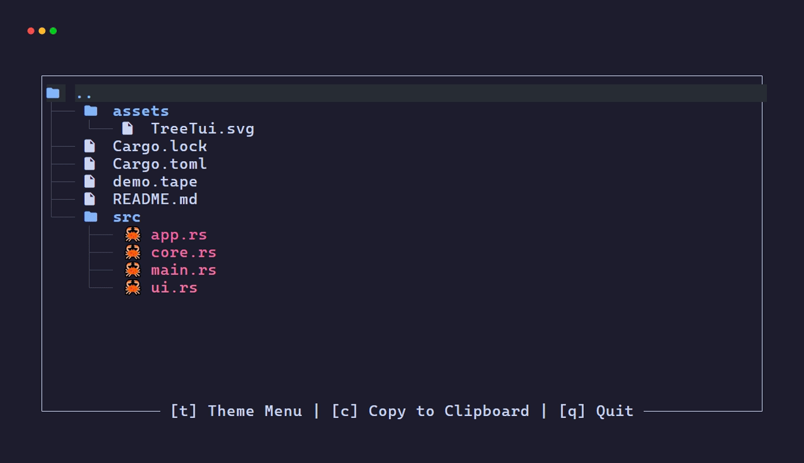

<div align="center">


# Tree TUI

### *A fast and customizable terminal tree viewer built with Rust and Ratatui.*

---



</div>

## Features

* Edit themes directly inside the application using a keyboard-driven menu.
* View live updates for text colors and animations.
* Choose between preset animation styles like linear, sine, and pingpong, or use a custom number for the animation speed.
* Copy the tree output to your clipboard while keeping all text formatting and icons.
* Set custom rules that target specific files, directories, or both.

---

## Installation

You need to have Rust installed on your computer. Download the code and build it:

```bash
git clone https://github.com/aaron-munozc/Tree-tui.git
cd tree-tui
cargo build --release

```

The program will be located at `./target/release/tree-tui`.

---

## Usage

Run the program in your terminal. You can use different flags to change how it works:

```bash
tree-tui                  # View the current folder
tree-tui --depth 3        # Stop looking after 3 folders deep
tree-tui --no-ignore      # Show files that are usually hidden by .gitignore
tree-tui --no-clipboard   # Disable the clipboard feature
tree-tui --sort-mode size # Sort items by size (options: name, extension, size, modified)
tree-tui --max-entries 5  # Limit files shown per folder to 5 (folders are always shown)

```

### Available Flags

* **`-d, --depth <NUM>`**: Limit the depth of the directory tree displayed.


* **`--no-ignore`**: Include files and directories typically ignored by `.gitignore`.


* **`--no-clipboard`**: Disable copying the tree output to the clipboard.


* **`-s, --sort-mode <MODE>`**: Change how files and directories are sorted. Available options are `name`, `extension`, `size`, and `modified`.


* **`-m, --max-entries <NUM>`**: Restrict the number of files displayed per directory. Directories are completely exempt from this limit to ensure your structural tree remains visible.


### Key Bindings

#### Main Tree View

| Key | Action |
| --- | --- |
| `t` | Open the theme menu. |
| `c` | Copy the current tree to your clipboard. |
| `j` / `k` / `Up` / `Down` | Move up and down the list. |
| `PageUp` / `PageDown` | Scroll the list by 15 items. |
| `q` | Close the program. |

#### Theme Menu

| Key | Action |
| --- | --- |
| `Enter` / `e` | Open the theme editor. |
| `a` | Apply the selected theme. |
| `j` / `k` / `Up` / `Down` | Move up and down the list. |
| `q` / `Esc` | Go back to the main tree view. |

#### Theme Editor

| Key | Action |
| --- | --- |
| `Up` / `Down` / `Tab` | Move between input fields. |
| `Enter` | Open dropdown menus for targets and animation styles. |
| `Ctrl + N` | Add a new rule. |
| `Ctrl + D` | Delete the current rule. |
| `Ctrl + S` | Save your changes and apply them. |
| `Esc` | Go back to the theme menu. |

---

## Configuration

Themes are saved as TOML files in your operating system's standard configuration folder under a `themes` directory.

Here is an example of a rule for Rust files:

```toml
[[rules]]
glob = "*.rs"
target = "File"
colors = "#F38BA8, #E10098"
icon = "rs"
anim_speed = 2.0
anim_easing = "sine"

```

```
